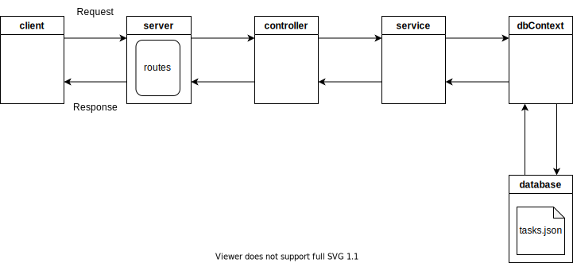

# express-js-diskdb-api

A simple api using express.js

## Requirements

* node.js ([https://nodejs.dev/learn/making-http-requests-with-nodejs](https://))
* express.js ([https://expressjs.com/](https://))
* diskdb [https://github.com/arvindr21/diskdb](https://)
* Postman (optional for testing api)

## Diagram




## Components

* config (config.js)

  - configuration file
* server (server.js)

  - creates server and listens on a port 3000
  - defines routes and accepts requests (routes.js)
* controller

  - handles requests
* service (service.js)

  - handles business logic
* model

  - data
* dbContext (dbContext.js)

  - handles db connection
* database (tasks.json)

  - task database file in json format

## Run

Run the following command from the root directory:

```
node server.js
```

## Tests

Try the following urls in Postman.

* GetTasks (GET)

  * http://127.0.0.1:3000/gettasks
* GetTask (GET)

  * http://127.0.0.1:3000/gettask/1
* AddTask (POST)

  * http://127.0.0.1:3000/addtask
  * body -> raw, json
  * { "id" : 1, "name": "task1", "description": "task1", "priority": "low", "status": "none" }
* UpdateTask (POST)

  * http://127.0.0.1:3000/updatetask
  * body -> raw, json
  * { "id" : 1, "name": "task11", "description": "task11", "priority": "medium", "status": "started" }
* DeleteTask (POST)

  * http://127.0.0.1:3000/deletetask
  * body -> raw, json
  * { "id" : 1 }
